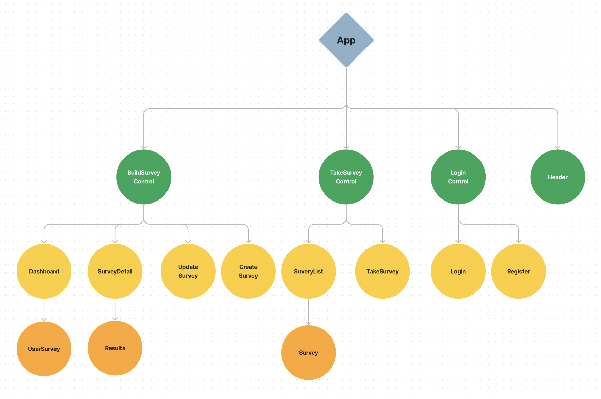
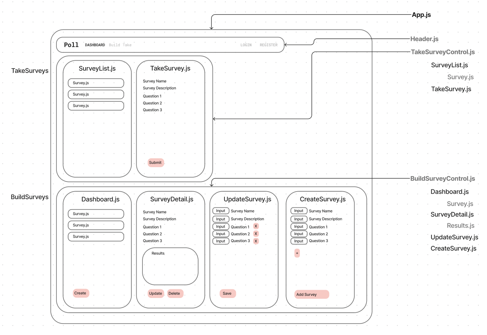

# Poll

#### By Kirsten Opstad

#### A web app for simple polling

#### [Check out the live site](https://ko-poll.web.app/)!

## Technologies Used

* React
* JavaScript
* Bootstrap
* HTML
* CSS
* webpack
* Node.js

## Description

__Prompt__

Create an application that allows a user to complete a quiz or survey. Users should be able to create new quizzes or surveys while other users should have the ability to fill out those surveys. To make this prompt a bit easier, you can have a set number of questions for each quiz or survey — that way, the surveys don't need to be dynamically rendered. (For instance, the form could have fields for response1, response2, and so on.)

### Objectives (MVP)

The application should have the following functionality:
* ✅ A user should be able to create, update and delete a survey. All surveys should be stored in the database.
* ✅ A user should be able to fill out and submit surveys. Survey results should be submitted to the database. (A survey result can be associated to a survey by mimicking a one-to-many relationship.)
* ✅ A user should be able to sign up, sign in, and sign out.
* ✅ A user should have their own dashboard which lists the surveys they've created.

__Further Exploration__
Bonus: A user should be able to see the combined data on a survey in their dashboard. For instance, if a survey provides a 1-5 rating, return an average rating for all surveys.
Challenging: Try using a library like D3 to visualize data from surveys. This is only recommended if you have time to spare, interest in data visualization, and are doing one project for the entire course section.

## Process 
1. ✅ Create component drawing & basic wireframe

[](https://www.figma.com/file/q9vYIxueWEQ3z1E21PJE5n/Poll?node-id=2%3A87&t=MJqgU5YfrYwAPySF-1)

[](https://www.figma.com/file/q9vYIxueWEQ3z1E21PJE5n/Poll?node-id=2%3A87&t=MJqgU5YfrYwAPySF-1)

2. ✅ Establish Component Hierarchy:
    * App.js
      * Header.js 
      * TakeSurveyControl.js
        * SurveyList.js
          * Survey.js
        * TakeSurvey.js
      * BuildSurveyControl.js
        * Dashboard.js
          * Survey.js
        * SurveyDetail.js
          * Result.js
        * UpdateSurvey.js
        * CreateSurvey.js
3. ✅ Build Static Components
4. ✅ Add State for conditional rendering
5. ✅ Add firebase
5. Style

<!-- [x] Screenshots

 -->

<!-- [Link to operational site](http://www.kirstenopstad.github.com/<REPOSITORY NAME>) -->

### Goals
1. ✅ Meet MVP
2. Add combined results (average if rating)
3. Add visualization with D3

## Setup/Installation Requirements

* Clone this repo to your workspace.
* Navigate to the top level of the directory.
* In the root directory of the project, run this command to install all packages listed in the package.json:
```
$ npm install
```
* Then, to build and serve the project, run: 
```
$ npm run start
```

## Known Bugs

* No known bugs. If you find one, please email me at kirsten.opstad@gmail.com with the subject **[_Repo Name_] Bug** and include:
  * BUG: _A brief description of the bug_
  * FIX: _Suggestion for solution (if you have one!)_
  * If you'd like to be credited, please also include your **_github user profile link_**

## License

MIT License

Copyright (c) 2023 Kirsten Opstad

Permission is hereby granted, free of charge, to any person obtaining a copy of this software and associated documentation files (the "Software"), to deal in the Software without restriction, including without limitation the rights to use, copy, modify, merge, publish, distribute, sublicense, and/or sell copies of the Software, and to permit persons to whom the Software is furnished to do so, subject to the following conditions:

The above copyright notice and this permission notice shall be included in all copies or substantial portions of the Software.

THE SOFTWARE IS PROVIDED "AS IS", WITHOUT WARRANTY OF ANY KIND, EXPRESS OR IMPLIED, INCLUDING BUT NOT LIMITED TO THE WARRANTIES OF MERCHANTABILITY, FITNESS FOR A PARTICULAR PURPOSE AND NONINFRINGEMENT. IN NO EVENT SHALL THE AUTHORS OR COPYRIGHT HOLDERS BE LIABLE FOR ANY CLAIM, DAMAGES OR OTHER LIABILITY, WHETHER IN AN ACTION OF CONTRACT, TORT OR OTHERWISE, ARISING FROM, OUT OF OR IN CONNECTION WITH THE SOFTWARE OR THE USE OR OTHER DEALINGS IN THE SOFTWARE.
